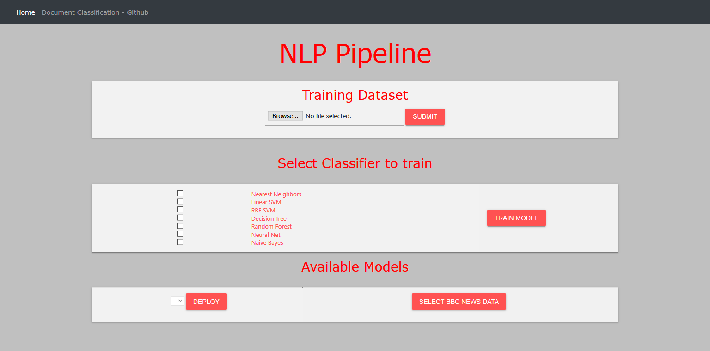

# document-classification

This project is an attempt to provide a generic pipeline for document classification using different machine learning
 models which can be hosted on any cloud service without any difficulty. This repo is connected to heroku cloud 
 and it has been hosted as an flask app https://nlp-pipe.herokuapp.com/.
 
 Features of this project are following:
 - Online training of models using custom training data provided by user.
 - Define the split ratio for training and validation of result. By default 80-20 split has been provided.
 - Visualize the results and get pickle file for trained model.
 - Use pickle file of model to do prediction.

## Features
- Below mentioned following functionalities are provided as an flask app and can be hosted on any cloud platform.
- This repo is directly connected to heroku platform and hence any new push to repo will result the changes to be 
reflected in Heroku app in real time hosted at https://nlp-pipe.herokuapp.com/.
- Initially it takes time to start the heroku instance, once up it can be used and UI will be displayed like where

1. Upload User input in csv file having two columns namely document and category
2. Feature Engineering
	- [X] Removing english stop words i.e. sklearn stopwords
	- [X] Stemming and lemmatization
	- [X] TF-IDF
	- [] Word2Vec
3. Model Building using default params
	- Naive-Bayes
	- SVM
	- Random forest
	- Nearest Neighbors
    - Linear SVM
    - Decision Tree
    - Random Forest
    - Neural Net
    
     Training of all models (even single model sometimes) takes more than 30 seconds for large dataset. Free version
     of Heroku instance doesn't support that. If you really want to test the app you can host it on AWS or mail me.
4. Test the result of models by providing text input.
5. Deployment of each model as an API.

## Running on AWS
1. Install all the packages using `pip3 install -r requirements.txt`
2. `sudo python3 -m nltk.downloader -d /usr/share/nltk_data`
3. Then download all-corpora and stopwords
4. Run the flask app using `sudo python3 -m flask run --host=0.0.0.0 --port=80`.
5. App can be opened on public ip provided in aws console.

## Using gunicorn and nginx (needs to be configured properly for AWS machine)
1. `pip install gunicorn`
2. `sudo apt-get install nginx`
3. To start nginx server `sudo /etc/init.d/nginx start`
4. `sudo apt-get install gunicorn3`
5. `gunicorn app:app -b localhost:8000 &`

##  Task List
  - Make an api for pickle files to be consumed.
  - Deployment of each model as an API and provide an end point for user.
  - Make trained model files downloadable to user.

### Contact:
You are welcome to contribute to the project, please send a pull request with proper feature description.
For any suggestion/clarification please raise an issue in git.

### References:
 - https://pyliaorachel.github.io/blog/tech/system/2017/07/07/flask-app-with-gunicorn-on-nginx-server-upon-aws-ec2-linux.html
 - http://nginx.org/en/docs/beginners_guide.html#conf_structure
 - https://www.digitalocean.com/community/tutorials/how-to-serve-flask-applications-with-gunicorn-and-nginx-on-ubuntu-14-04

